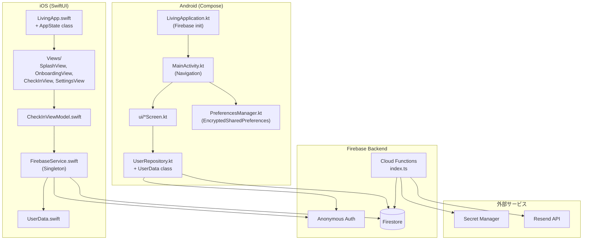
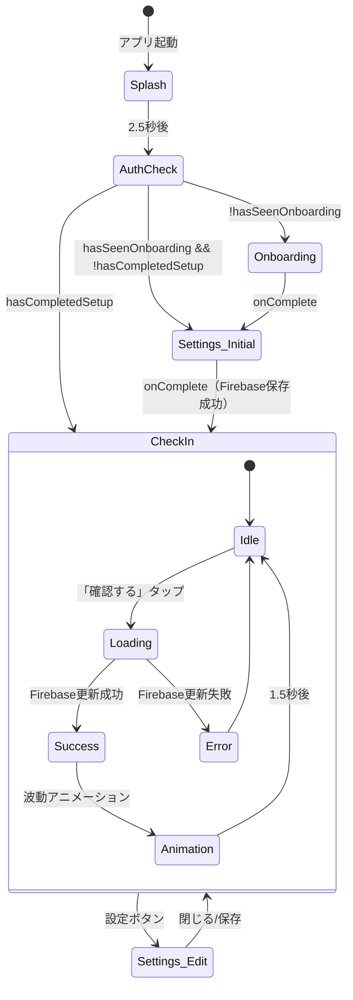
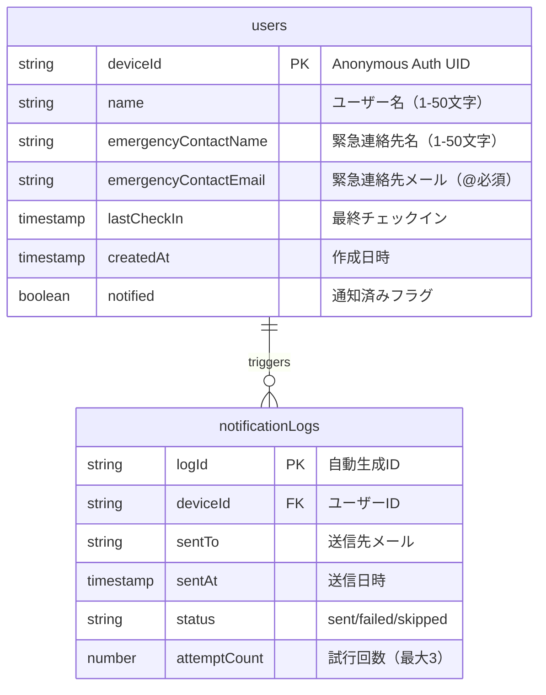
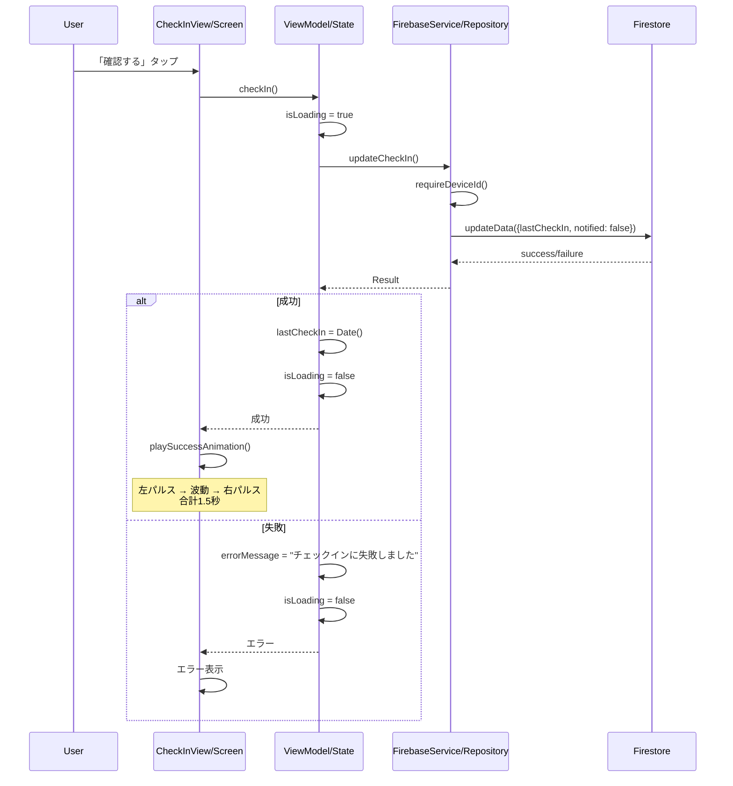
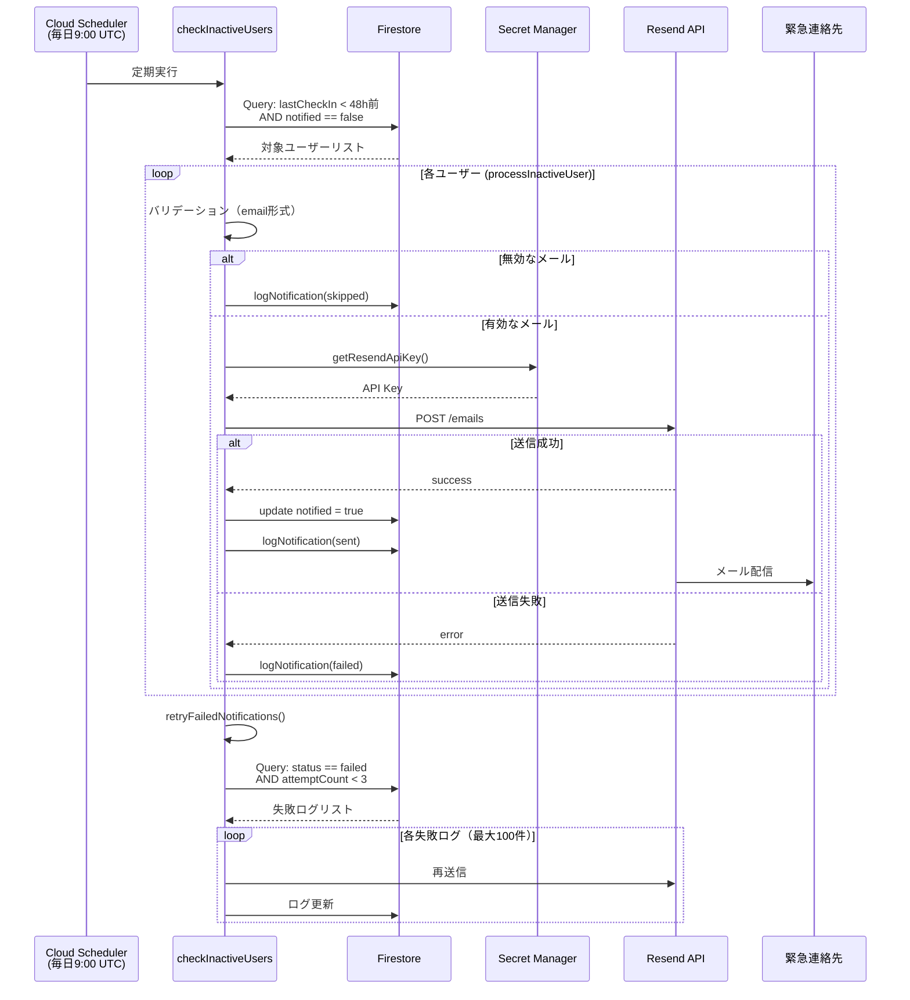
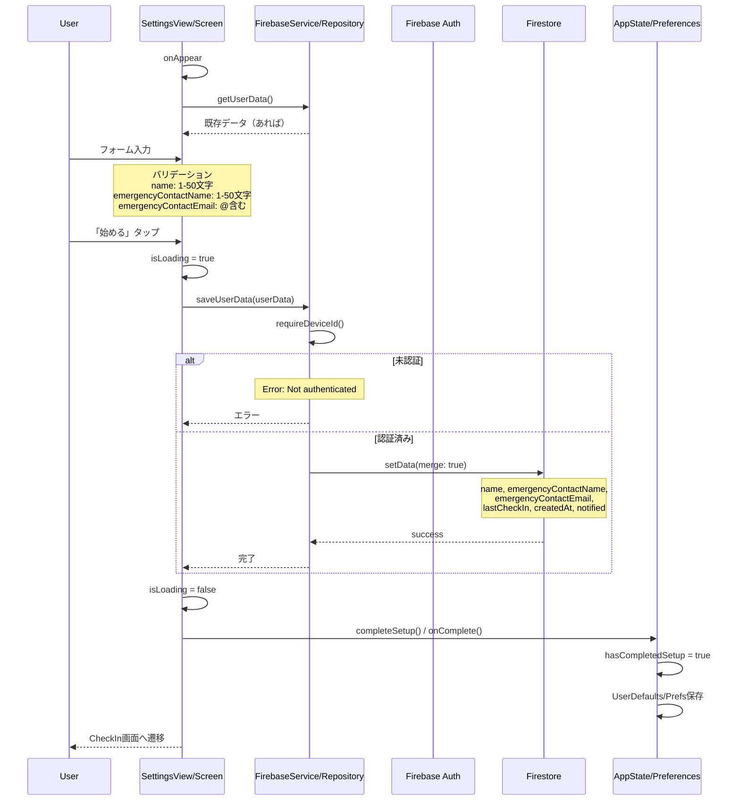
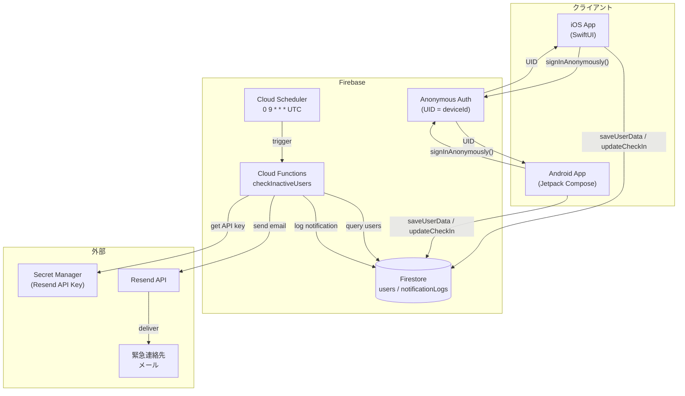

# Living プロジェクト コードリーディングガイド

このガイドは、Livingプロジェクトのコードベースを効率的に理解するための手順書です。
**実際のコードを調査した上で作成しています。**

---

## 初回セットアップ（AIアシスタント向けプロンプト）

```
あなたはLivingプロジェクトの解析専門家です。

## プロジェクト概要
- **アプリ名**: 生きろ。
- **機能**: 生存確認アプリ（毎日チェックイン、2日間未確認で緊急連絡先に通知）
- **プラットフォーム**: iOS (SwiftUI) + Android (Jetpack Compose) + Firebase

## 主要機能（3つ）
1. チェックイン - 緑のボタンを毎日タップ
2. 通知 - 2日間未チェックで緊急連絡先にメール（一度だけ）
3. 登録 - 名前と緊急連絡先のみ（ログイン不要、Anonymous Auth）

## 解析のゴール
コードを読み、構造を理解し、図解化して説明すること。
```

---

## ステップ0: 全体俯瞰

### フェーズ1: 関連ファイルの特定（実際の構成）

| レイヤー | iOS | Android |
|---------|-----|---------|
| **エントリー** | `LivingApp.swift` | `LivingApplication.kt` + `MainActivity.kt` |
| **画面** | `Views/*.swift` | `ui/*Screen.kt` |
| **ViewModel** | `CheckInViewModel.swift` | Screen内のremember states |
| **状態管理** | `AppState`（LivingApp.swift内） | `PreferencesManager.kt` |
| **Firebase通信** | `FirebaseService.swift` | `UserRepository.kt` |
| **データモデル** | `UserData.swift` | `UserRepository.kt`内のdata class |

### フェーズ2: プロジェクト構造図



### フェーズ3: 画面遷移図



### フェーズ4: ER図（Firestore）



---

## ステップ1: 中間層の深掘り

### iOS: FirebaseService（実際のコード）

```swift
// ios/Living/Services/FirebaseService.swift

final class FirebaseService {
    static let shared = FirebaseService()
    private let db = Firestore.firestore()
    private init() {}

    /// deviceId = Anonymous Auth UID
    var deviceId: String? {
        Auth.auth().currentUser?.uid
    }

    private func requireDeviceId() throws -> String {
        guard let id = deviceId else {
            throw FirebaseServiceError.notAuthenticated
        }
        return id
    }

    /// ユーザーデータ保存
    func saveUserData(_ userData: UserData) async throws {
        let id = try requireDeviceId()
        var data = userData.toFirestore()
        data["createdAt"] = FieldValue.serverTimestamp()
        data["lastCheckIn"] = FieldValue.serverTimestamp()
        data["notified"] = false
        try await db.collection("users").document(id).setData(data, merge: true)
    }

    /// チェックイン更新
    func updateCheckIn() async throws {
        let id = try requireDeviceId()
        try await db.collection("users").document(id).updateData([
            "lastCheckIn": FieldValue.serverTimestamp(),
            "notified": false  // 通知フラグをリセット
        ])
    }
}
```

**重要ポイント**:
- Singleton パターン（`static let shared`）
- `deviceId` = `Auth.auth().currentUser?.uid`
- チェックイン時に `notified = false` でリセット

### iOS: AppState（実際のコード）

```swift
// ios/Living/App/LivingApp.swift 内

class AppState: ObservableObject {
    @Published var hasSeenOnboarding: Bool
    @Published var hasCompletedSetup: Bool
    @Published var isAuthReady = false
    private var authSetupDone = false

    init() {
        self.hasSeenOnboarding = UserDefaults.standard.bool(forKey: "hasSeenOnboarding")
        self.hasCompletedSetup = UserDefaults.standard.bool(forKey: "hasCompletedSetup")
    }

    func setupAuth() {
        guard !authSetupDone else { return }
        authSetupDone = true

        if Auth.auth().currentUser != nil {
            DispatchQueue.main.async { self.isAuthReady = true }
            return
        }

        Auth.auth().signInAnonymously { [weak self] result, error in
            DispatchQueue.main.async { self?.isAuthReady = true }
        }
    }
}
```

**重要ポイント**:
- `LivingApp.swift` 内に定義（別ファイルではない）
- `isAuthReady` で認証完了を監視
- `setupAuth()` は一度だけ実行

### Android: UserRepository（実際のコード）

```kotlin
// android/app/src/main/java/com/living/app/data/UserRepository.kt

data class UserData(
    val name: String = "",
    val emergencyContactName: String = "",
    val emergencyContactEmail: String = "",
    val lastCheckIn: Date? = null,
    val notified: Boolean = false
)

class UserRepository {
    private val db = FirebaseFirestore.getInstance()

    private val deviceId: String?
        get() = Firebase.auth.currentUser?.uid

    private fun requireDeviceId(): String {
        return deviceId ?: throw IllegalStateException("Not authenticated")
    }

    private val userRef
        get() = db.collection("users").document(requireDeviceId())

    suspend fun saveUserData(userData: UserData) {
        val data = hashMapOf(
            "name" to userData.name,
            "emergencyContactName" to userData.emergencyContactName,
            "emergencyContactEmail" to userData.emergencyContactEmail,
            "lastCheckIn" to FieldValue.serverTimestamp(),
            "createdAt" to FieldValue.serverTimestamp(),
            "notified" to false
        )
        userRef.set(data).await()
    }

    suspend fun updateCheckIn() {
        userRef.update(
            mapOf(
                "lastCheckIn" to FieldValue.serverTimestamp(),
                "notified" to false
            )
        ).await()
    }
}
```

**重要ポイント**:
- `UserData` は同じファイル内に定義
- `deviceId` = `Firebase.auth.currentUser?.uid`
- `requireDeviceId()` で未認証時にException

### Android: LivingApplication（実際のコード）

```kotlin
// android/app/src/main/java/com/living/app/LivingApplication.kt

class LivingApplication : Application() {
    private val applicationScope = CoroutineScope(SupervisorJob() + Dispatchers.Main)

    override fun onCreate() {
        super.onCreate()
        FirebaseApp.initializeApp(this)
        signInAnonymously()  // 起動時に匿名認証
    }

    private fun signInAnonymously() {
        val auth = Firebase.auth
        if (auth.currentUser != null) return  // 既にサインイン済み

        applicationScope.launch {
            try {
                auth.signInAnonymously().await()
            } catch (e: Exception) {
                e.printStackTrace()  // 次回起動時に再試行
            }
        }
    }
}
```

**重要ポイント**:
- `Application` クラスで Firebase 初期化
- Anonymous Auth は起動時に自動実行

### Firebase Functions（実際のコード）

```typescript
// firebase/functions/src/index.ts

// スケジュール: 毎日9:00 UTC
export const checkInactiveUsers = functions.pubsub
  .schedule("0 9 * * *")  // cron形式
  .timeZone("UTC")
  .onRun(async () => {
    // 48時間前のタイムスタンプ
    const threshold = new Date(Date.now() - 48 * 60 * 60 * 1000);

    // 未チェック AND 未通知のユーザーを取得
    const snapshot = await db
      .collection("users")
      .where("lastCheckIn", "<", threshold)
      .where("notified", "==", false)
      .get();

    for (const doc of snapshot.docs) {
      await processInactiveUser(doc.id, doc.data());
    }

    await retryFailedNotifications();  // 失敗した通知の再試行
  });

// 失敗した通知の再試行（最大3回）
async function retryFailedNotifications(): Promise<void> {
  const failedLogs = await db
    .collection("notificationLogs")
    .where("status", "==", "failed")
    .where("attemptCount", "<", 3)
    .orderBy("sentAt", "desc")
    .limit(100)
    .get();
  // ...
}
```

**重要ポイント**:
- スケジュール: `0 9 * * *`（毎日9:00 UTC）
- クエリ条件: `lastCheckIn < 48時間前 AND notified == false`
- 再試行: 最大3回まで

---

## ステップ2: チェックイン処理の詳細

### シーケンス図



### iOS実装（CheckInView.swift:36-43, CheckInViewModel.swift:17-30）

```swift
// CheckInView.swift
Button(action: {
    Task {
        await viewModel.checkIn()
        if viewModel.errorMessage == nil {
            playSuccessAnimation()
        }
    }
}) { ... }

// CheckInViewModel.swift
func checkIn() async {
    isLoading = true
    errorMessage = nil
    do {
        try await firebaseService.updateCheckIn()
        lastCheckIn = Date()
        isLoading = false
    } catch {
        isLoading = false
        errorMessage = "チェックインに失敗しました"
    }
}
```

### Android実装（CheckInScreen.kt:74-91）

```kotlin
Button(
    onClick = {
        scope.launch {
            isLoading = true
            errorMessage = null
            try {
                repository.updateCheckIn()
                lastCheckIn = Date()
                showSuccessAnimation = true
                delay(1500)
                showSuccessAnimation = false
            } catch (e: Exception) {
                errorMessage = "チェックインに失敗しました"
            }
            isLoading = false
        }
    },
    // ...
)
```

---

## ステップ3: 通知バッチ処理の詳細

### シーケンス図



### メール本文（実際のテンプレート）

```typescript
// firebase/functions/src/index.ts:111-122
await resend.emails.send({
    from: "Living <noreply@7th-bridge.com>",
    to: contactEmail,
    subject: `【Living】${userName}さんの生存確認通知`,
    text: `${contactName}様

${userName}さんが2日間Livingアプリでチェックインしていません。
ご確認をお願いいたします。

---
Living - 生存確認アプリ`,
});
```

---

## ステップ4: ユーザー登録フローの詳細

### シーケンス図



### バリデーション（iOS: SettingsView.swift:139-145）

```swift
private var isValid: Bool {
    !name.trimmingCharacters(in: .whitespaces).isEmpty &&
    !emergencyContactName.trimmingCharacters(in: .whitespaces).isEmpty &&
    emergencyContactEmail.contains("@") &&
    name.count <= 50 &&
    emergencyContactName.count <= 50
}
```

### バリデーション（Android: SettingsScreen.kt:36-40）

```kotlin
val isValid = name.trim().isNotEmpty() &&
        name.length <= 50 &&
        emergencyContactName.trim().isNotEmpty() &&
        emergencyContactName.length <= 50 &&
        emergencyContactEmail.contains("@")
```

---

## ショートカットプロンプト集

### 【クイックチェックイン】

```
Livingプロジェクトのチェックイン機能を解析してください。

対象ファイル:
- iOS: ios/Living/Views/CheckInView.swift (36-43行, 113-157行)
       ios/Living/Views/CheckInViewModel.swift (全体)
       ios/Living/Services/FirebaseService.swift (59-66行)
- Android: android/.../ui/CheckInScreen.kt (74-91行, 191-323行)
           android/.../data/UserRepository.kt (81-88行)

確認ポイント:
1. ボタンタップ → updateCheckIn() の呼び出し
2. Firestoreへの書き込み（lastCheckIn, notified: false）
3. 波動アニメーション（ConnectionDotsView/Animation）
4. エラーハンドリング

出力: フローチャートと主要コード抜粋
```

### 【クイック通知】

```
LivingプロジェクトのCloud Functions通知バッチを解析してください。

対象ファイル:
- firebase/functions/src/index.ts (全体)

確認ポイント:
1. スケジュール: "0 9 * * *"（毎日9:00 UTC）
2. クエリ条件: lastCheckIn < 48時間前 AND notified == false
3. processInactiveUser() - メール送信処理
4. sendEmergencyEmail() - Resend API呼び出し
5. retryFailedNotifications() - 失敗時のリトライ（最大3回）
6. logNotification() - notificationLogsへの記録

出力: シーケンス図と主要コード抜粋
```

### 【クイック登録】

```
Livingプロジェクトのユーザー登録フローを解析してください。

対象ファイル:
- iOS: ios/Living/Views/SettingsView.swift (139-145行, 159-190行)
       ios/Living/App/LivingApp.swift (53-102行 AppState)
       ios/Living/Services/FirebaseService.swift (32-41行)
- Android: android/.../ui/SettingsScreen.kt (36-40行, 188-205行)
           android/.../data/PreferencesManager.kt (全体)
           android/.../data/UserRepository.kt (50-60行)

確認ポイント:
1. バリデーション（name, email形式、文字数制限）
2. saveUserData() の実装
3. AppState/PreferencesManager での状態管理
4. 画面遷移ロジック

出力: フローチャートと状態遷移図
```

### 【クイック認証フロー】

```
LivingプロジェクトのAnonymous Auth認証フローを解析してください。

対象ファイル:
- iOS: ios/Living/App/LivingApp.swift (79-101行 setupAuth)
- Android: android/.../LivingApplication.kt (24-40行 signInAnonymously)

確認ポイント:
1. 認証の初期化タイミング
2. 既存ユーザーのチェック
3. deviceId（Auth UID）の取得方法
4. isAuthReady 状態の管理

出力: 認証フロー図
```

---

## 付録A: ファイルマップ（実際の構成）

### iOS

```
ios/Living/
├── App/
│   └── LivingApp.swift          # エントリー + AppState class
├── Views/
│   ├── SplashView.swift         # スプラッシュ（2点が繋がるアニメ）
│   ├── OnboardingView.swift     # オンボーディング（3画面）
│   ├── CheckInView.swift        # メイン画面 + ConnectionDotsView + Date拡張
│   ├── CheckInViewModel.swift   # チェックイン用ViewModel
│   └── SettingsView.swift       # 設定画面 + SystemTextFieldStyle
├── Models/
│   └── UserData.swift           # データモデル + Firestore変換
├── Services/
│   └── FirebaseService.swift    # Firebase操作（Singleton）
└── Firebase/
    ├── Dev/GoogleService-Info.plist
    └── Prod/GoogleService-Info.plist
```

### Android

```
android/app/src/main/java/com/living/app/
├── LivingApplication.kt         # Application + Firebase初期化 + Anonymous Auth
├── MainActivity.kt              # エントリー + 画面遷移ロジック
├── ui/
│   ├── SplashScreen.kt          # スプラッシュ画面
│   ├── OnboardingScreen.kt      # オンボーディング
│   ├── CheckInScreen.kt         # メイン画面 + ConnectionDotsAnimation
│   ├── SettingsScreen.kt        # 設定画面
│   └── theme/Theme.kt           # Material 3テーマ
└── data/
    ├── UserRepository.kt        # Firebase操作 + UserData class
    └── PreferencesManager.kt    # EncryptedSharedPreferences

android/app/src/
├── dev/google-services.json     # dev環境
└── prod/google-services.json    # prod環境
```

### Firebase

```
firebase/
├── .firebaserc                  # dev: livingdev-5cb56, prod: living-2b928
├── firebase.json                # デプロイ設定
├── firestore.rules              # セキュリティルール
├── firestore.indexes.json       # インデックス設定
└── functions/
    ├── package.json
    ├── tsconfig.json
    └── src/
        └── index.ts             # checkInactiveUsers + ヘルパー関数
```

---

## 付録B: データフロー全体図



---

## 付録C: 既知の問題と調査ポイント

### 問題1: 設定画面の「始める」ボタンが反応しない

**現象**: ボタンをタップしても画面遷移しない場合がある

**調査対象ファイル**:
- iOS: `LivingApp.swift:29-31`（onComplete コールバック）
- iOS: `SettingsView.swift:177-181`（save 完了後の処理）
- Android: `SettingsScreen.kt:199-200`（onComplete 呼び出し）

**調査ポイント**:
1. `isAuthReady` が `true` になっているか
2. `FirebaseService.saveUserData()` が成功しているか
3. `onComplete` コールバックが正しく呼ばれているか
4. Firestore セキュリティルール（`auth.uid == deviceId`）

**確認コマンド**:
```bash
# Firebaseプロジェクト確認
firebase projects:list

# Firestoreデータ確認（dev）
firebase use dev
firebase firestore:get users/<deviceId>

# Functions ログ確認
firebase functions:log --only checkInactiveUsers
```

---

## 付録D: 解析時のチェックリスト

### 新機能追加時
- [ ] iOS/Android両方に実装が必要か
- [ ] Firestoreスキーマの変更は必要か
- [ ] セキュリティルール（`auth.uid == deviceId`）の更新
- [ ] Cloud Functionsの変更は必要か
- [ ] 環境分離（dev/prod）の確認

### バグ修正時
- [ ] iOS/Androidで同じ問題が起きるか
- [ ] Firebase Console でエラーログを確認
- [ ] Firestoreのデータ状態を確認
- [ ] Anonymous Auth の状態を確認
- [ ] 再現手順を明確化

### コードレビュー時
- [ ] `requireDeviceId()` でのエラーハンドリング
- [ ] `isLoading` 状態の適切な管理
- [ ] UI/UXの一貫性（iOS/Android間）
- [ ] バリデーションルールの一致
