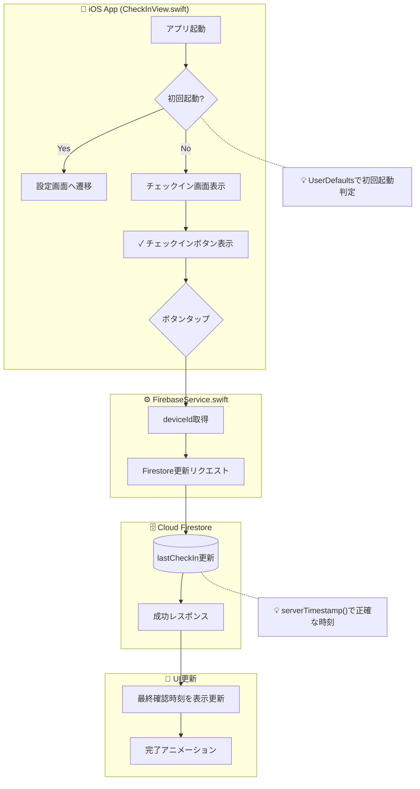
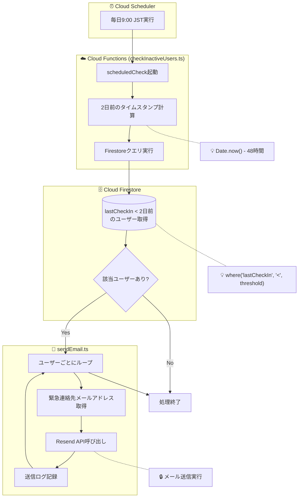
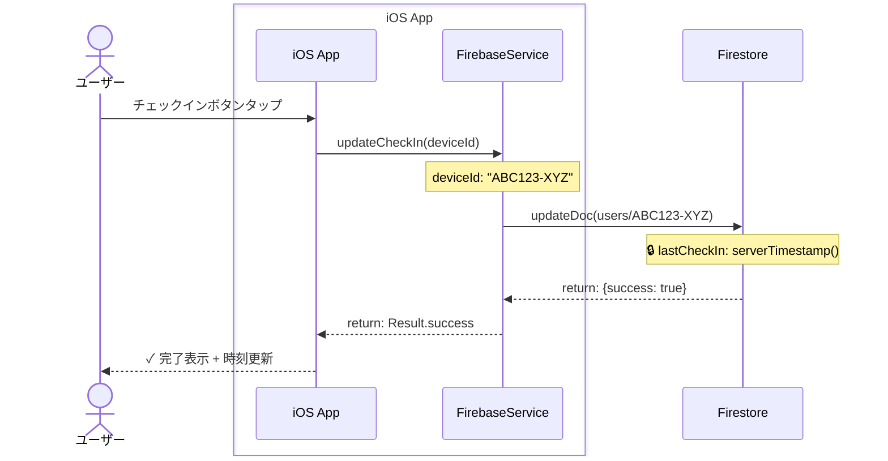
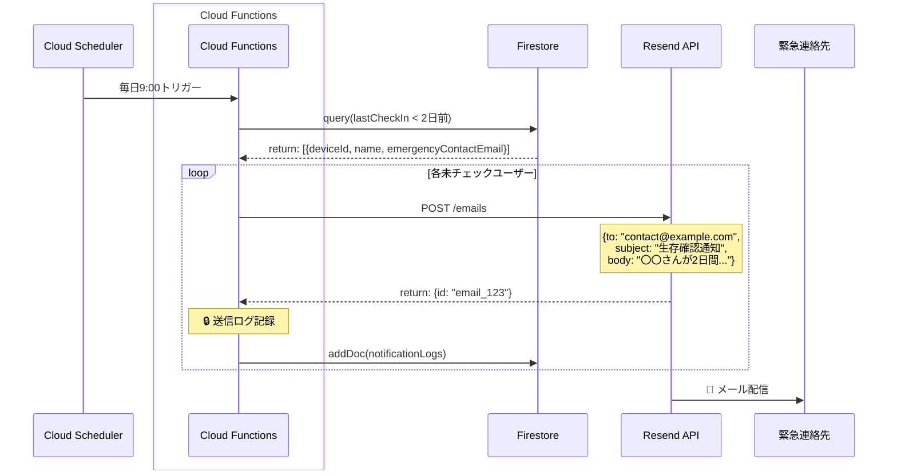
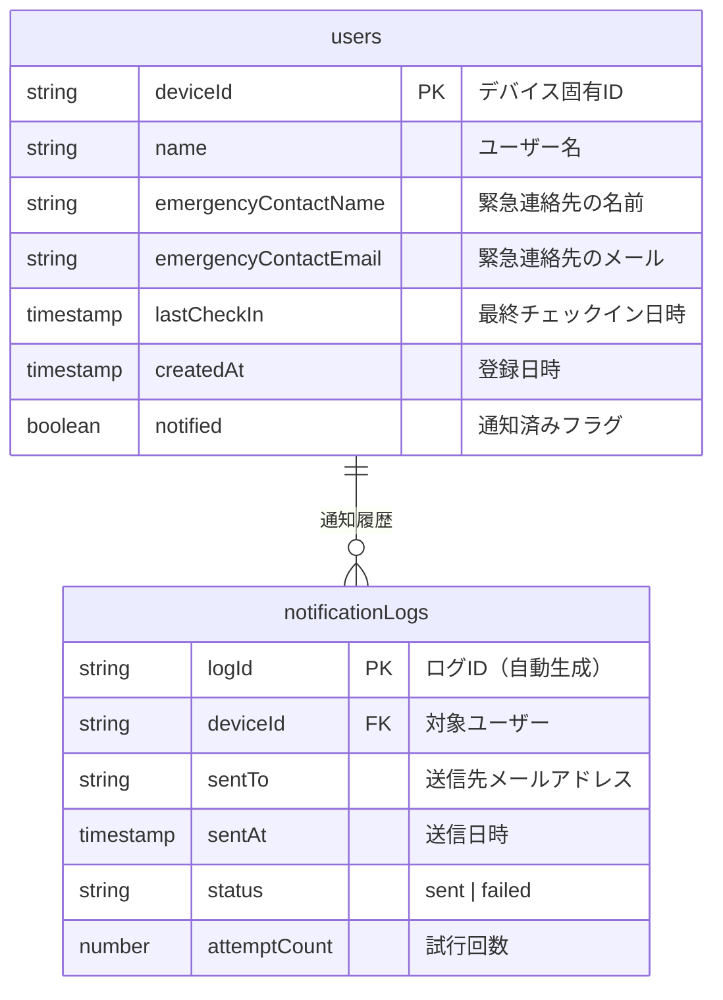

# Living - 設計ドキュメント

## 概要

Demumu（死了么）クローン。毎日チェックインし、2日間未チェックで緊急連絡先にメール通知。

---

## ステップ0: 全体俯瞰

### フェーズ1: コンポーネントマップ

```
┌─────────────────────────────────────────────────────────────┐
│                        Living App                           │
├─────────────────────────────────────────────────────────────┤
│                                                             │
│  ┌─────────────┐    ┌─────────────┐    ┌─────────────┐     │
│  │   iOS App   │    │ Android App │    │  Firebase   │     │
│  │  (SwiftUI)  │    │  (Compose)  │    │  Backend    │     │
│  └──────┬──────┘    └──────┬──────┘    └──────┬──────┘     │
│         │                  │                  │             │
│         └────────┬─────────┘                  │             │
│                  │                            │             │
│                  ▼                            ▼             │
│         ┌───────────────┐           ┌─────────────────┐    │
│         │   Firestore   │◄──────────│ Cloud Functions │    │
│         │   Database    │           │  (Scheduler)    │    │
│         └───────────────┘           └────────┬────────┘    │
│                                              │             │
│                                              ▼             │
│                                     ┌─────────────────┐    │
│                                     │     Resend      │    │
│                                     │   (Email API)   │    │
│                                     └─────────────────┘    │
│                                                             │
└─────────────────────────────────────────────────────────────┘
```

### 画面とファイルの対応

| 画面 | iOS | Android | 役割 |
|------|-----|---------|------|
| チェックイン | `CheckInView.swift` | `CheckInScreen.kt` | メイン画面、チェックインボタン |
| 設定 | `SettingsView.swift` | `SettingsScreen.kt` | 名前・緊急連絡先登録 |

### バックエンドファイル

| ファイル | 役割 |
|----------|------|
| `functions/src/index.ts` | Cloud Functions エントリーポイント |
| `functions/src/checkInactiveUsers.ts` | 2日間未チェックユーザー検出 |
| `functions/src/sendEmail.ts` | Resend API でメール送信 |

### 全体の流れ

```
[ユーザー] → [チェックイン画面] → [Firestore更新]
                                        ↓
[Cloud Scheduler] → [Cloud Functions] → [Firestore照会]
                                        ↓
                            [2日間未チェック検出]
                                        ↓
                            [Resend経由でメール送信]
```

---

### フェーズ2: 図解化

## 1. 処理の流れ

### チェックイン処理

| 順序 | ファイル | 関数 | 引数 | 戻り値 | 処理内容 |
|------|----------|------|------|--------|----------|
| 1 | `CheckInView.swift` | `onCheckInTapped()` | - | - | ボタンタップイベント処理 |
| 2 | `FirebaseService.swift` | `updateCheckIn(deviceId)` | deviceId: String | Result<Void> | Firestoreのタイムスタンプ更新 |
| 3 | Firestore | - | - | - | `lastCheckIn` フィールド更新 |

### 通知処理（バックエンド）

| 順序 | ファイル | 関数 | 引数 | 戻り値 | 処理内容 |
|------|----------|------|------|--------|----------|
| 1 | `index.ts` | `scheduledCheck` | - | - | Cloud Schedulerからトリガー |
| 2 | `checkInactiveUsers.ts` | `findInactiveUsers()` | - | User[] | 2日間未チェックユーザー取得 |
| 3 | `sendEmail.ts` | `sendEmergencyEmail(user)` | user: User | Result | Resend APIでメール送信 |

---

## 2. フローチャート（チェックイン処理）



---

## 3. フローチャート（通知処理）



---

## 4. シーケンス図（チェックイン処理）



---

## 5. シーケンス図（通知処理）



---

## 6. ER図



### 💡 CRUD操作マッピング

| テーブル | Create | Read | Update | Delete |
|----------|--------|------|--------|--------|
| users | 初回設定時 | アプリ起動時 | チェックイン時、通知時 | - |
| notificationLogs | メール送信時 | 再試行判定時 | 再試行時 | - |

### 通知抑制ルール（重要）

**通知は一度だけ送信する:**

1. `users.notified = false` の状態で2日間未チェック → メール送信
2. 送信後 `users.notified = true` に更新
3. ユーザーがチェックインしたら `users.notified = false` にリセット

```
チェックイン時:
  lastCheckIn = now
  notified = false  ← リセット

通知送信時:
  notified = true   ← 再送信防止
```

**クエリ条件:**
```typescript
// 通知対象: 2日間未チェック AND 未通知
where('lastCheckIn', '<', threshold)
  .where('notified', '==', false)
```

---

## ステップ2: 詳細解析の計画

### 処理の全体構造

```
Living App
├── ユーザーフロー
│   ├── 初回起動 → 設定画面 → 名前・連絡先登録
│   └── 通常起動 → チェックイン画面 → ボタンタップ
│
└── バックエンドフロー
    └── 毎日バッチ → 未チェック検出 → メール送信
```

### 詳細分析が必要な箇所

| 優先度 | 箇所名 | ファイル | 分析理由 |
|--------|--------|----------|----------|
| 高 | チェックイン処理 | `CheckInView.swift` | コア機能 |
| 高 | 2日間判定ロジック | `checkInactiveUsers.ts` | 通知の正確性に直結 |
| 中 | 初回設定フロー | `SettingsView.swift` | UX上重要 |
| 中 | メール送信処理 | `sendEmail.ts` | 外部API連携 |
| 低 | デバイスID生成 | `FirebaseService.swift` | 永続性確保 |

---

## ステップ3: 各箇所の詳細設計

### 箇所1: チェックイン処理

**Input-Process-Output:**

| 項目 | 内容 |
|------|------|
| **Input** | ユーザーのボタンタップイベント |
| **Process** | 1. deviceId取得 → 2. Firestore更新 → 3. UI更新 |
| **Output** | 画面に「最終確認: たった今」表示 |

### 箇所2: 2日間判定ロジック

**Input-Process-Output:**

| 項目 | 内容 |
|------|------|
| **Input** | Cloud Schedulerからのトリガー |
| **Process** | 1. 現在時刻-48時間を計算 → 2. Firestoreクエリ → 3. 該当者抽出 |
| **Output** | 未チェックユーザーの配列 `User[]` |

**判定ルール:**
```
現在時刻: 2024-01-17 09:00:00 UTC
閾値: 2024-01-15 09:00:00 UTC (48時間前)

lastCheckIn < 閾値 AND notified == false → 通知対象
```

**タイムゾーン方針:**
- 全ての時刻計算は **UTC** で統一
- `serverTimestamp()` は自動的にUTC
- スケジューラ遅延（数分程度）は許容範囲内

### 箇所3: メール送信処理

**Input-Process-Output:**

| 項目 | 内容 |
|------|------|
| **Input** | `{name, emergencyContactEmail}` |
| **Process** | 1. メール本文生成 → 2. Resend API呼び出し → 3. ログ記録 |
| **Output** | メール送信結果 + notificationLogsレコード |

**メール内容:**
```
件名: 【Living】〇〇さんの生存確認通知

本文:
〇〇さんが2日間Livingアプリでチェックインしていません。
ご確認をお願いいたします。

---
Living - 生存確認アプリ
```

---

## 実装チェックリスト

### iOS

- [ ] 💡 Context: UserDefaultsで初回起動判定
- [ ] 💡 Context: deviceIdはUUID.uuidString()で生成、Keychainに保存
- [ ] 🔒 DB保存: serverTimestamp()でlastCheckIn更新

### Android

- [ ] 💡 Context: SharedPreferencesで初回起動判定
- [ ] 💡 Context: deviceIdはUUID.randomUUID()で生成
- [ ] 🔒 DB保存: FieldValue.serverTimestamp()で更新

### Cloud Functions

- [ ] 💡 Context: 48時間 = 48 * 60 * 60 * 1000 ms
- [ ] 🔒 DB保存: notificationLogsに送信結果記録
- [ ] ファイルがsubgraphで囲まれている ✓

---

## 技術的決定事項

### deviceIdの永続化

| プラットフォーム | 保存先 | 理由 |
|------------------|--------|------|
| iOS | Keychain | アプリ再インストールでも維持 |
| Android | EncryptedSharedPreferences | セキュア + 永続 |

### タイムゾーン

- Cloud Functions: **UTC** で計算
- 表示: **ユーザーのローカルタイムゾーン** で変換

### エラーハンドリング

| 状況 | 対応 |
|------|------|
| ネットワークエラー | ローカルに保存、次回起動時に同期 |
| Firestore書き込み失敗 | リトライ3回、失敗時はエラー表示 |
| メール送信失敗 | notificationLogsにstatus: "failed"記録、翌日再試行（最大3回） |

### メール送信再試行ルール

```
attemptCount < 3 AND status == "failed" → 再試行対象
attemptCount >= 3 → 諦める（手動対応が必要）
```

### バリデーション

| 項目 | ルール |
|------|--------|
| emergencyContactEmail | メール形式チェック（@を含む） |
| name | 1文字以上、50文字以下 |
| emergencyContactName | 1文字以上、50文字以下 |

**メール未設定/無効の場合:**
- 通知処理をスキップ
- notificationLogsにstatus: "skipped"を記録

---

## 確定した設計方針

| 項目 | 決定 |
|------|------|
| 通知回数 | **一度だけ**（チェックインでリセット） |
| 端末対応 | **1端末=1ユーザー**（シンプル優先） |
| タイムゾーン | **UTC統一** |
| 認証 | **なし**（deviceIdのみ） |
